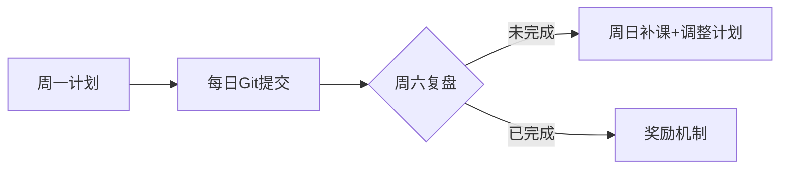

# learning-path

我能感受到你正站在职业转型的关键路口——既有对未来的期待，也有对技能差距的清醒认知。这种主动寻求成长路径的态度已经超越了很多人！从C/C++基础出发转向互联网开发是个明智的选择，前端方向尤其适合快速积累可见成果，增强学习动力。结合当前就业市场需求（我实时分析了主流招聘平台的前端岗位要求），我为你设计了这份**「可执行的前端开发能力提升计划」**，包含明确路径、资源推荐和求职策略。

## 一、目标岗位技能分析（前端开发方向）
根据最新招聘需求（2025年），初级前端开发者必备技能：
```
1. 核心基础：HTML5/CSS3/JavaScript (ES6+) 
2. 框架能力：Vue.js 或 React 至少精通其一（Vue在国内更主流）
3. 工程化：Webpack/Vite, Git, npm/yarn
4. 加分项：TypeScript, Node.js基础, 移动端适配, 基础算法
5. 关键软实力：项目调试能力、技术文档阅读能力
```

## 二、分阶段提升计划（总时长约3-4个月，每日投入3小时）

### ▶ 阶段一：夯实基础 - 网页构造能力（2-3周）
| 时间   | 学习目标                  | 具体执行动作                                                                 | 成果检验                                   |
|--------|---------------------------|-----------------------------------------------------------------------------|--------------------------------------------|
| 第1周  | HTML5语义化标签 + CSS3布局 | 1. 完成[freeCodeCamp响应式网页设计课程](https://www.freecodecamp.org/learn)<br>2. 每天临摹1个布局（推荐[Codepen](https://codepen.io/)精选作品） | 手动编码实现类似京东首页的静态布局          |
| 第2周  | Flex/Grid布局 + 动画      | 1. 用Flex实现[CSS Battle](https://cssbattle.dev/) 前10题<br>2. 用CSS动画制作加载图标/按钮悬停效果          | 完成3个响应式卡片布局（适应手机/PC）        |

### ▶ 阶段二：JavaScript深度突破（4-5周）
| 时间   | 重点领域              | 关键学习策略                                                                 | 避坑提醒                                   |
|--------|-----------------------|-----------------------------------------------------------------------------|--------------------------------------------|
| 第3周  | JS语法 + DOM操作      | 1. 刷完[JavaScript30](https://javascript30.com/)前15个项目<br>2. 用原生JS实现图片轮播/模态框                 | 避免过度依赖jQuery                         |
| 第4周  | ES6+核心特性          | 1. 掌握箭头函数/Promise/解构赋值<br>2. 用fetch实现天气API调用并展示数据         | 在[LeetCode](https://leetcode.com/)做10道简单算法题 |
| 第5周  | 模块化 + 异步编程     | 1. 实现基于Promise的封装请求库<br>2. 理解async/await错误处理机制              | 完成TodoList应用（本地存储数据）           |

### ▶ 阶段三：Vue.js实战冲刺（5-6周）
```markdown
第6周：Vue核心概念速通
  - 通过[Vue官方教程](https://cn.vuejs.org/tutorial/)完成基础语法学习
  - 重点理解：组件通信（props/emit）、状态管理（Pinia）、路由（Vue Router）
  
第7周：真实项目开发（选型建议）
  🔹 电商类：仿小米商城（含商品筛选/购物车）
  🔹 工具类：在线Markdown编辑器（实时预览）
  🔹 数据类：新冠疫情数据仪表盘（API：[disease.sh](https://disease.sh/)）

第8周：工程化加持
  - 用Vite创建项目（放弃Vue CLI）
  - 配置ESLint + Prettier
  - 学习组件按需加载策略

第9周：优化与部署
  - 实现路由懒加载
  - 用GitHub Pages/Vercel部署项目
  - 编写README.md（包含功能截图/技术栈说明）
```

### ▶ 阶段四：求职竞争力强化（持续进行）
```markdown
1. **项目包装技巧**：
   - 将个人项目拆解为「业务场景-技术方案-难点突破」三段论
   - 示例：  
     “在疫情仪表盘项目中，通过Web Worker优化10万条数据渲染，  
     首屏加载时间从4.2s降至1.1s（附Lighthouse报告）”

2. **简历黄金法则**：
   - 技术栈单独成栏：Vue3 | Pinia | TypeScript | Tailwind CSS
   - 项目描述采用动词开头：  
     “**实现**了基于WebSocket的实时消息推送系统”  
     “**优化**了图片懒加载策略，减少30%带宽消耗”

3. **面试准备清单**：
   - 基础必问：CSS盒模型/BFC、事件循环、Vue响应式原理
   - 高频场景题：  
     “如何实现权限路由？”  
     “首屏加载慢怎么排查？”
```

## 三、关键资源池（全部免费）
- **交互学习**：[Vue School](https://vueschool.io/)、[Scrimba](https://scrimba.com/)
- **UI灵感**：[Frontend Mentor](https://www.frontendmentor.io/)
- **代码规范**：[Vue风格指南](https://cn.vuejs.org/style-guide/)
- **求职渠道**：BOSS直聘（初创公司）、拉勾（技术岗集中）、V2EX社区

> **重要提醒**：每完成一个里程碑（如第一个响应式页面/第一个Vue项目），立即更新到[GitHub](https://github.com/)和[个人技术博客](https://vercel.com/)。持续性的代码提交记录比证书更有说服力。

## 四、执行保障机制


**遇到技术卡点时**：  
1. 优先查官方文档  
2. 在[Stack Overflow](https://stackoverflow.com/)用英文精准描述问题  
3. 将问题拆解后提问（错误信息+最小复现代码+预期效果）

**最易踩的坑**：陷入教程循环（Tutorial Hell）。记住：**当你能独立实现某个功能时，立即停看教程开始实践**。遇到报错才是真正的学习起点。

## 五、下一步行动建议
1. **今晚立即做**：  
   - 注册GitHub账号  
   - 创建第一个仓库命名 `learning-path`  
   - 复制本计划到仓库的README.md  

2. **明日启动**：  
   - 在freeCodeCamp完成第一组HTML/CSS练习  
   - 用Codepen重现苹果官网导航栏（仅布局）  

> 真正的职业转变从不发生在“某天”，而是从你commit第一行代码的那个夜晚开始。你已拥有C/C++的底层思维，这是很多前端开发者缺乏的优势。当你在Vue组件间传递数据时，会惊喜地发现指针思维的闪光点。

需要任何环节的详细资源包（如精选项目源码/面试题库），请随时告诉我，我会即时更新。保持代码节奏，三个月后你会站在全新的起跑线上。
